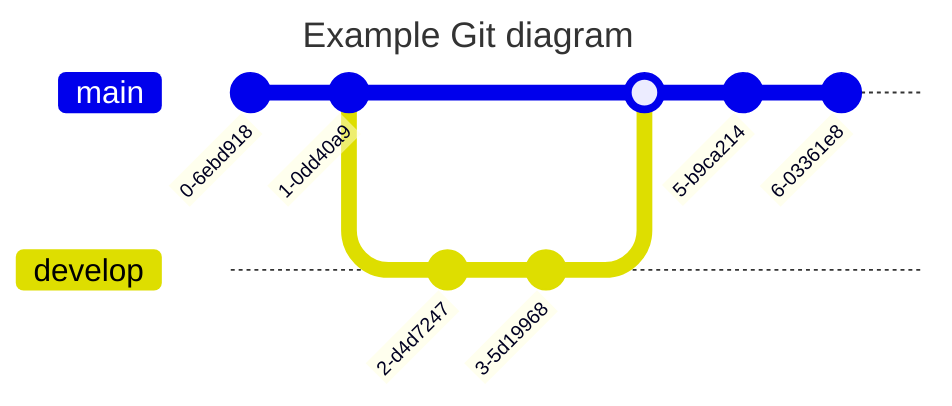
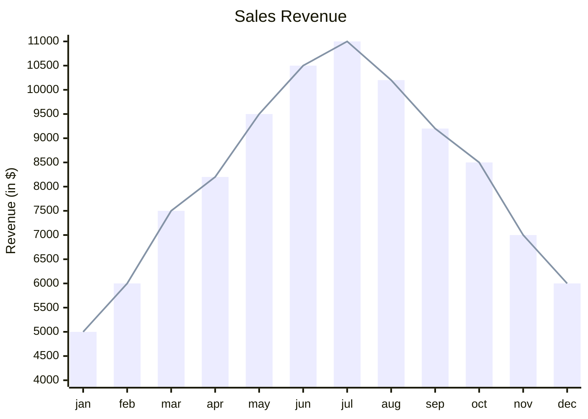
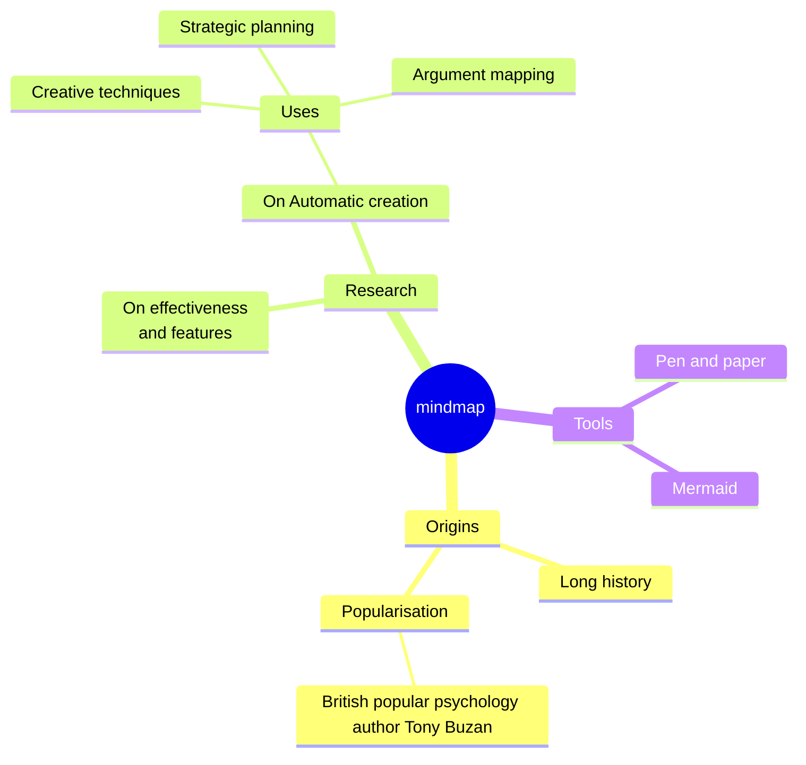

# MarkFlow
Preview Mermaid and Markdown Document with Single HTML file.

**Usage**:

1. Drag markdown document file (*.md) to this HTML page.

2. Done.

## Mermaid Charts

Here is simple examples from mermaid site:

Example of XY Graph:

Example of Mindmap:

